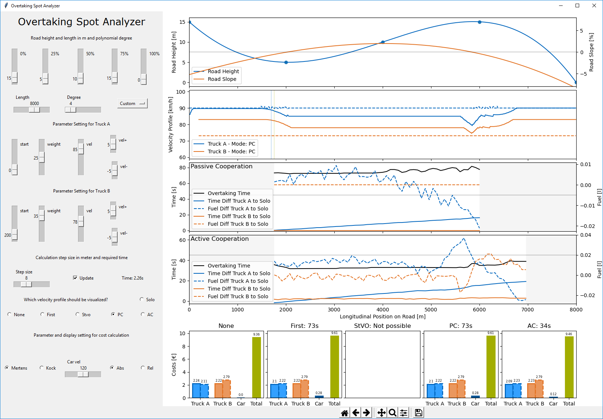
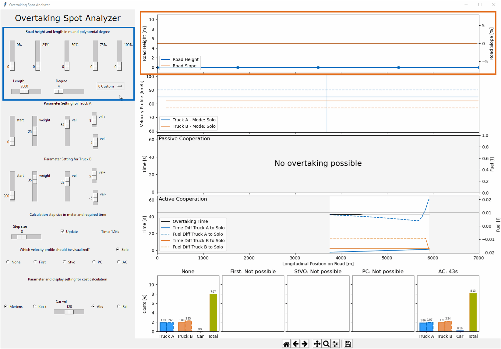
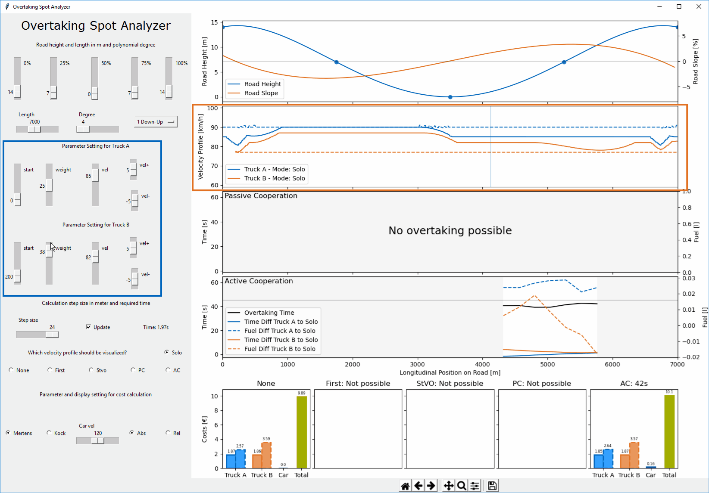

# Truck Overtaking Spot Analyzer


_Picture 1: Screenshot of the "Truck Overtaking Analyzer GUI"_


Truck overtaking maneuvers on the freeway are often perceived as dangerous elephant races.
The aim of this tool is to show how truck overtaking maneuvers can be executed safer and more efficiently for all parties involved through cooperation.
For this purpose two points are examined in particular:
* Where does the overtaking maneuver start
* How to adjust the velocities

The road and the trucks involved (trucks A and B) can be parameterized via the GUI. Various scenarios are then played through:
* Truck A does not overtake (no cooperation)
* Truck A overtakes at the first opportunity (no cooperation)
* Truck A overhauled as soon as it conforms to StVO (no cooperation)
* Truck A searches for the best time to overtake (passive cooperation)
* Truck A and Truck B search for the best time to overtake and actively adjust their velocity (active cooperation)

The tool provides the costs for each of these scenarios and thus makes it possible to demonstrate the advantages of cooperative truck overtaking maneuvers in monetary terms.


## Getting Started
The "Truck Overtaking Spot Analyzer" tool is composed of three files.

| File | Description |
|----|----|
 [OvetakingSpotAnalyzerGUI.py](OvertakingSpotAnalyzerGUI.py) | This file contains the GUI that allows the user to parameterize the scenario and displays the results of the overtaking spot analyzer. 
 [OvertakingSpotAnalyzer.py](OvertakingSpotAnalyzer.py) | This is the actual core module that conducts the overtaking analysis. It is triggered be the GUI and returns its results back to the GUI. 
 [Vehicle.py](Vehicle.py) | This file contains a vehicle model of heavy duty truck as well as its GPS-Cruise-Control to predict the velocity profile. The vehicle is used by the Overtaking Spot Analyzer for the physical modeling of the trucks. 

To start the tool run the [`OvertakingSpotAnalyzerGUI.py`](OvertakingSpotAnalyzerGUI.py) script. 


### Python Version and Dependencies
All the code was tested with Python 3.7, newer versions should also work. The code was tested for compliance with Windows machines. Use the provided [`requirements.txt`](requirements.txt) in the root directory of this repository, in order to install all required modules.
`pip3 install -r /path/to/requirements.txt`. The GUI is a Tkinter Application which comes pre-installed with python. 


## Running the Model/Code
### Define the Road
The first step is to define the height profile of the road segment. 
The corresponding GUI elements are in the blue rectangle of Animation 1. 
You can either select a predefined road from the drop down menu or use the sliders. 
The road-profile and the resulting slope is displayed in the top plot (orange rectangle). 

 
_Animation 1: Adjust the road profile_

### Define the Trucks
The next step is to parametrize Truck A and Truck B. 
Each truck has a starting point on the road, a vehicle mass, a set-velocity and positive and negative hysteresis. 
The corresponding GUI elements are in the blue rectangle of Animation 2.
The resulting velocity profiles are displayed in the second plot (orange rectangle). 

 
_Animation 2: Adjust the truck settings_

### Set Calculation Details
The tool is constantly updating the truck overtaking spot analysis and plots the new results. 
This can be stopped by deselecting the "Update" checkbox. 
Further the "Stepsize" can be vary between calculation speed and accuracy. 
The required calculation time is displayed right next to "stepsize" slider

### Read the Output
The "Passive Cooperation" and "Active Cooperation" plots show the required duration and time/fuel-differences for each possible starting point of the overtaking maneuver. 
Within the gray area an overtaking maneuver is not possible, because Truck A has not reach B yet, or because the overtaking maneuver can not be finished before the road ends. 
The corresponding velocity profiles of each scenario von be visualized with the checkboxes on the left. 
The best possible costs for each scenario is displayed in the bottom plot. With the checkboxes you can either select the absolute "Abs" or relative "Rel" costs view.  


## License
This project is licensed under the LGPL License - see the LICENSE.md file for details


## Contributions
[1] J.C. Mertens et al., “Cooperative Truck Overtaking on Freeways,”
in 2020 Fifteenth International Conference on Ecological Vehicles and Renewable Energies (EVER), 2020.

Contact: [Jan Cedric Mertens](mailto:mertens@ftm.mw.tum.de).

If you find our work useful in your research, please consider citing:
```
@inproceedings{mertens2020a,
  title = {Cooperative Truck Overtaking on Freeways},
  booktitle = {2020 Fifteenth International Conference on Ecological Vehicles and Renewable Energies (EVER)},
  author = {Mertens, Jan Cedric; Jahn, Lennard; Hauenstein, Jürgen; Diermeyer, Frank; Kraus, Sven},
  year = {2020}
}
```